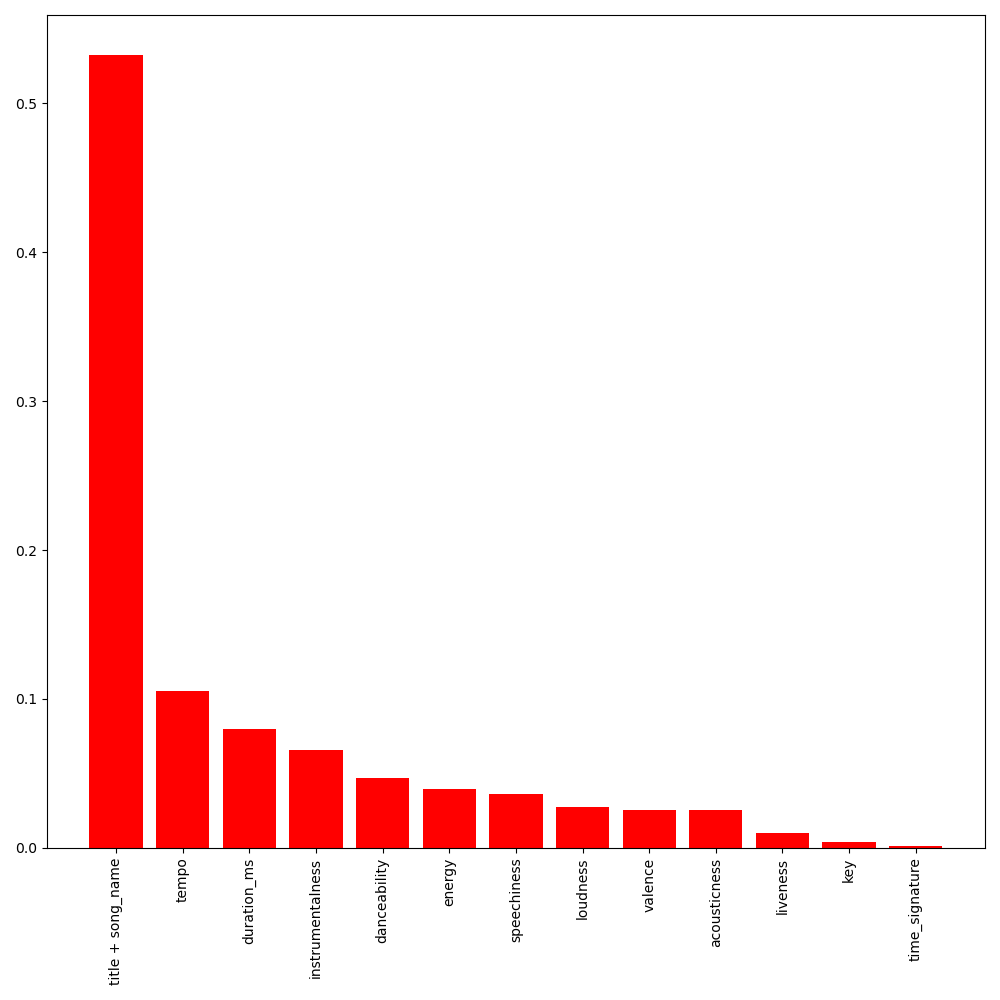
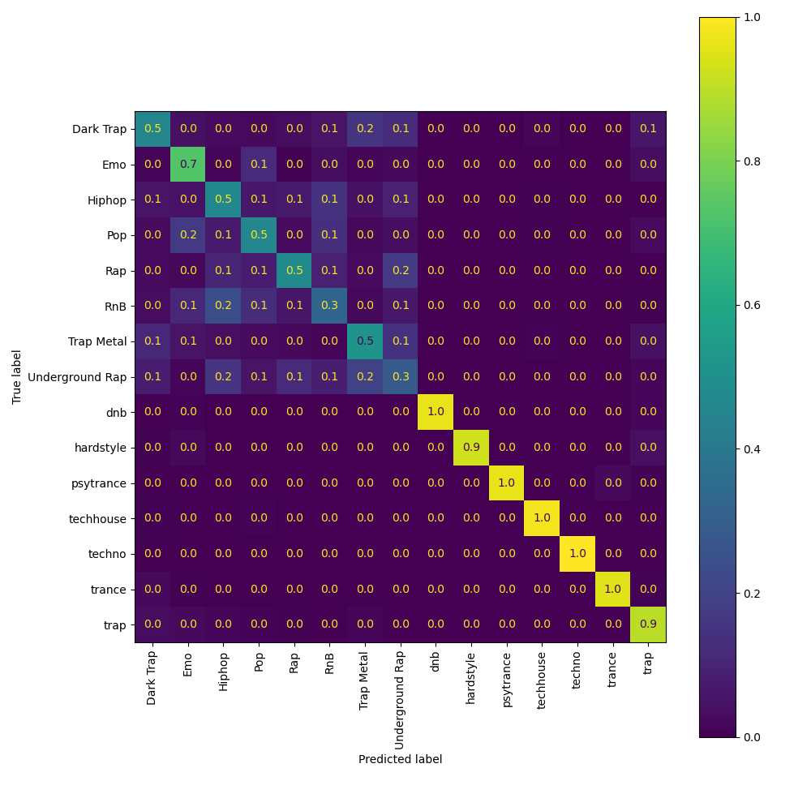

# song_genre_classification

## Project Description
This project creates a random forests classifier whose objective is to identify to which genre a song belongs.  

## Target & Predictors
The target for the model, `genre`, has 15 unique values (such as "Pop", "Rap", and "Emo".)

The predictors used are:
- A variety of numerical features, including scored values on relative scales such as `danceability` and `loudness` as well as measures such as `tempo` and `duration_ms`).
- Categorical (numeric) features such as `key` or `time_signature` (where each key or time signature is assigned a unique integer).
- One text-based feature, which is the `title` of each song which we transform using scikit-learn's `TfidfVectorizer`.

## Project Objectives: [process + tooling] >> [model performance]
Though developing a predictive model was an objective of this project, the primary aim was to employ the platform  [Weights and Biases](https://wandb.ai/site) along with the Python API of [`MLflow`](https://www.mlflow.org/docs/1.28.0/index.html) to create the model in a reproducible way.  

[Here is my W&B workspace for this project.](https://wandb.ai/jehansen0/song_genre_classification/overview?workspace=user-jehansen0)

Using these tools allowed for:
- Versioning data (original, train, validation, test)
- Controlling environments (via conda and config yaml files)
- Versioning other model artifacts (trained models, sklearn pipelines)
- Versioning results (AUC scores, confusion matrices)
- Tracking experiments (logging, results, artifacts, data, etc. all tied to a single run)

## Model Results & Analysis
Since the primary focus of the project was to learn and use W&B and MLflow I'll keep this section brief.  
Here are a few notes about the model and its performance:
- Final test performance: AUC=0.96825
- The feature repesenting song title (`title + song_name`) was by far the most important to generating accurate predictions. See feature importance plot below.
- The model did a fantastic job of predicting various kinds of electronic music (see the lower-right corner of the confusion matrix below). However, it did only a middling job at distinguishing between similar types of music. For example see the upper right corner of the confusion matrix below showing the model struggling to identify the similar `genre` values of Hiphop, Rap, RnB, and Underground Rap.
  - If we wanted to ameliorate the model's inability to distinguish between these similar genres I'd suggest two options:
    - Group some of these genres together into a single genre. If the music is similar enough that they shouldn't be different genres to begin with then this makes sense.
    - Accept that a model primarily using song title to predict genre will struggle to separate various rap, hip hop, R&B, and pop songs. Find better predictors to distiguish between these genres.

  
